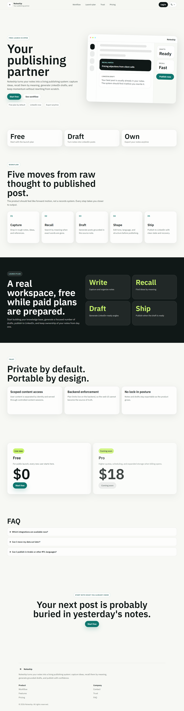
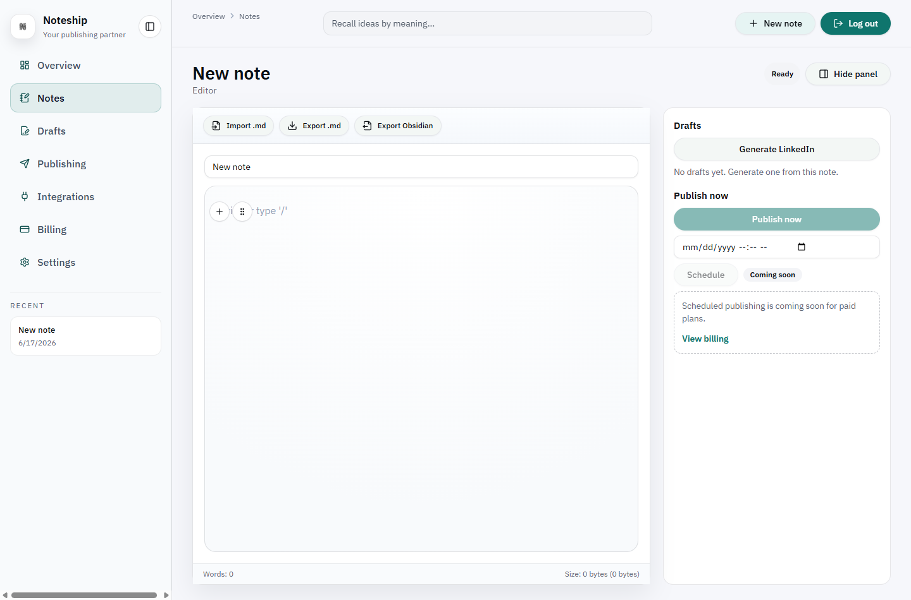
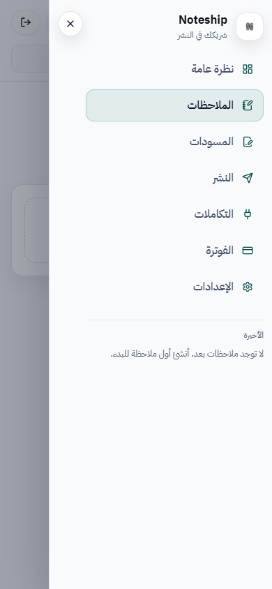
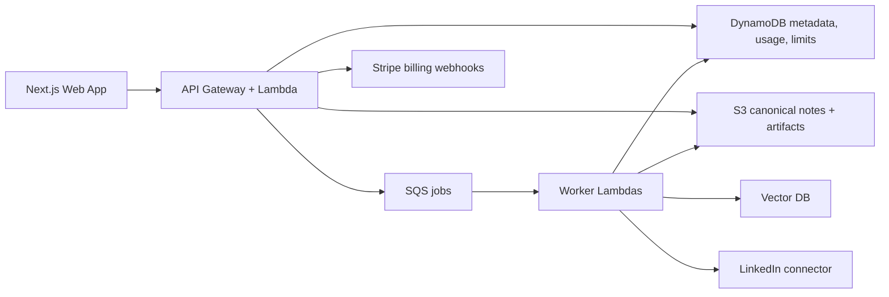

# Noteship

Noteship is a publishing workspace for turning long-lived notes into platform-ready posts without losing the source material. It keeps canonical notes in Markdown, supports bilingual/RTL editing, and routes publishing work through backend-controlled integrations instead of browser-side shortcuts.

a Next.js dashboard, Serverless Lambda API, SQS workers, typed domain contracts, DynamoDB/S3 storage, connector isolation, and plan-aware guardrails.



## Product Snapshot

| Dashboard editor                                                              | Arabic mobile navigation                                                             |
| ----------------------------------------------------------------------------- | ------------------------------------------------------------------------------------ |
|  |  |

## What Noteship Does

- Capture and edit notes in a rich TipTap editor that serializes back to Markdown.
- Import/export Markdown, including an Obsidian-friendly export path.
- Generate and manage publishing drafts from source notes.
- Publish through server-side connector flows, starting with LinkedIn.
- Keep the UI bilingual with LTR/RTL support across marketing, auth flows, dashboard shell, and editor direction controls.
- Enforce limits and entitlements from the backend, not from frontend visibility alone.

## Architecture

Noteship is intentionally small enough to reason about and structured enough to grow.



The short version:

- `apps/web`: static-exported Next.js app for marketing, auth, and dashboard.
- `apps/api`: API Gateway Lambda handlers with thin controllers and explicit use-case boundaries.
- `apps/workers`: async jobs for embedding, publishing, and scheduled dispatch.
- `packages/domain`: shared schemas, API contracts, features, plans, and entitlements.
- `packages/connectors`: vendor-specific integration code isolated from core app logic.
- `packages/infra`: CDK stacks for web hosting, API, workers, queues, tables, buckets, and guardrails.
- `packages/utils`: small cross-cutting helpers.

Authoritative docs live in:

- `docs/technical/noteship-system-architecture.md`
- `docs/technical/noteship-low-level-design.md`
- `docs/technical/index.md`

## What Is Quietly Deliberate

- Canonical content lives in S3 as Markdown; DynamoDB stores metadata and counters, not giant content blobs.
- API rate limits are plan-aware and backed by atomic DynamoDB buckets.
- New users are persisted on the Free plan, and inactive Stripe states resolve back to Free access.
- Connectors run server-side, so OAuth credentials and vendor tokens never need to reach the browser.
- The dashboard is responsive and RTL-aware without forking the product into separate language-specific UIs.

## Local Development

Prerequisites:

- Node.js compatible with the workspace toolchain.
- `pnpm` `9.12.0`.
- AWS/Auth0/Stripe/vendor values only when exercising those integrations.

Setup:

```bash
pnpm install
cp .env.example .env
pnpm dev
```

Useful commands:

```bash
pnpm lint
pnpm build
pnpm test
pnpm format
```

Focused commands:

```bash
pnpm --filter @noteship/web build
pnpm --filter @noteship/api test
pnpm --filter @noteship/workers test
pnpm --filter @noteship/domain test
pnpm --filter @noteship/infra synth
```

Frontend E2E is intentionally opt-in:

```bash
RUN_E2E=1 pnpm --filter @noteship/web test
```

## Contribution Rules

Read `AGENTS.md` first. The HLD and LLD are the source of truth; if implementation and docs disagree, the docs win.

Contribution docs:

1. `docs/contributing/TESTING-STRATEGY.md`
2. `docs/contributing/AI-AND-HUMAN-CONTRIBUTING.md`
3. `docs/contributing/ENV-AND-SECRETS.md`
4. `docs/contributing/CHANGE-TYPES-DECISION-MATRIX.md`
5. `docs/contributing/BACKEND-TESTING.md`
6. `docs/contributing/FRONTEND-TESTING.md`
7. `docs/contributing/PLAYWRIGHT-E2E.md`
8. `docs/contributing/QUALITY-GATES.md`

Minimum quality gates before merging:

- `pnpm lint`
- `pnpm build`
- `pnpm test`
- `pnpm format`

Do not commit secrets. Use `.env` locally, keep real runtime secrets in deployment environments, and check `docs/contributing/ENV-AND-SECRETS.md` before adding new configuration.

## Deployment

Deployment details live in `docs/technical/ops/deployment.md`.

Infra is CDK-based:

```bash
pnpm --filter @noteship/infra synth
cd packages/infra
cdk synth -c env=dev -c region=us-east-1
```

Current stack areas include web hosting, content storage, DynamoDB tables, API Lambdas, worker Lambdas, SQS queues/DLQs, and operational guardrails.

## Status

Noteship is MVP-stage software with production-shaped boundaries. Paid-plan and billing code paths available for readiness, while the current public launch posture can is free-only and backend-enforced.
