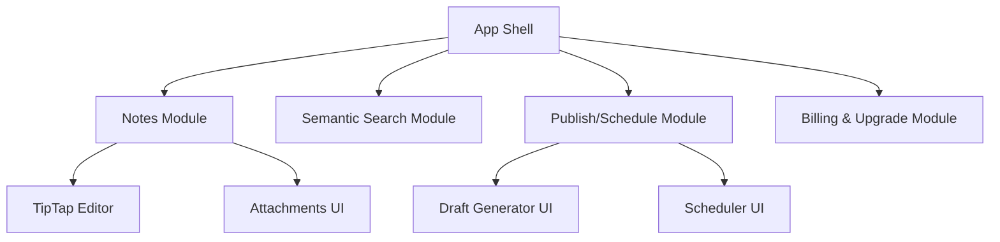

# Noteship — Frontend Architecture

## Purpose

Define the Next.js structure, state management, and integration points.

## Stack

- Next.js (single app for landing + dashboard)
- TypeScript (strict)
- Component library: shadcn/ui or similar
- Data fetching: TanStack Query
- Validation: zod schemas shared with backend
- i18n: English + Arabic (RTL/LTR) following brand rules (`docs/brand/noteship-language-guidelines.md`, `docs/brand/noteship-layout-rtl-ltr.md`, `docs/brand/noteship-typography.md`)
- Formatting: Prettier (repo-wide) with opinionated defaults; run `pnpm prettier --write .` after changes.

## App structure (suggested)

- `app/` routes
- `components/ui/` primitives
- `components/features/` feature modules (Notes, Search, Publish, Billing)
- `lib/api/` API clients
- `lib/auth/` auth helpers
- `lib/entitlements/` gating helpers
- `stores/` (only if needed; prefer Query + local state)
- `data/` localized public-page copy (`landing.ts` etc.) exporting `{ en, ar }` payloads including locale-specific images

## Feature gating

- Fetch entitlements on session load
- UI derives:
  - hide vs disable + upsell
- Backend always enforces

## Editor

- TipTap document in memory
- Serialize to Markdown for saving/export
- Attachments upload to S3 via backend-signed URL (recommended)
- Support per-block RTL/LTR direction; code blocks stay LTR; persist `language` on note/post metadata.

## i18n content strategy (public pages)

- Keep marketing copy out of components: source from `apps/web/data/<surface>.ts` with typed `{ en, ar }` objects.
- Store locale-specific media references (hero/proof screenshots) with the text to ensure mirrored visuals for RTL.
- Apply `lang` and `dir` on the page root; components consume pre-shaped copy to avoid conditional text in JSX.

## Mermaid: UI modules

## Error UX

- Show user-friendly failures for publish jobs
- Status polling or websocket later (MVP: polling)
