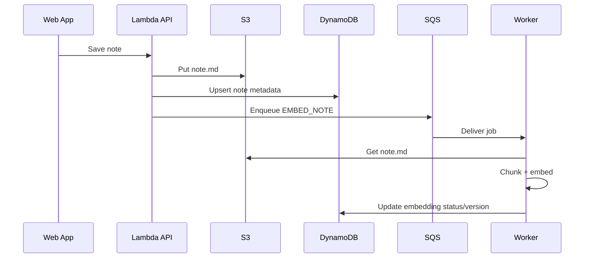

# Noteship — Backend Architecture

## Purpose
Define backend modules, DI approach, async patterns, and boundaries.

## Stack
- API Gateway (REST)
- Lambda (Node.js, TypeScript)
- DynamoDB, S3
- SQS workers (publishing + embedding)
- External: Vector DB, Stripe, LinkedIn, Medium

## Code architecture
Layers:
1) Handlers (Lambda entrypoints)
2) Use-cases (business logic)
3) Adapters (DDB/S3/Vector/Stripe/LinkedIn/Medium clients)
4) Domain (types, feature keys, entities)
5) Runtime (dependency wiring)

## DI approach (no library)
- Composition root builds `deps`
- Cache heavy clients at module scope for warm reuse
- Pass `deps` into use-cases for testability

## Async job model
- Use SQS for jobs:
  - `EMBED_NOTE`
  - `PUBLISH_POST`
- Worker Lambda handles job types
- Retry policy + DLQ
- Idempotency keys per job (postId/noteVersion)

## Mermaid: request to job

## Security boundaries
- User identity from JWT authorizer
- Per-user partitioning (userId as tenant)
- OAuth tokens encrypted at rest
