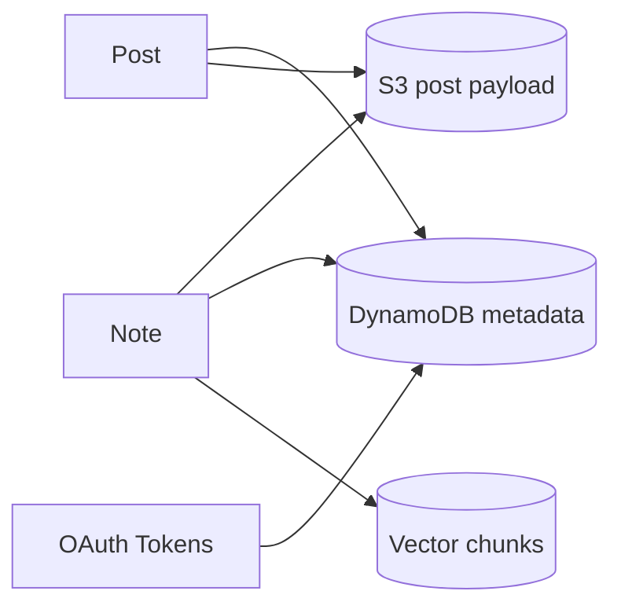

# Noteship — Data Architecture

## Purpose

Define how data is stored and referenced.

## Canonical content: S3

Paths (example):

- `users/{userId}/notes/{noteId}/note.md`
- `users/{userId}/notes/{noteId}/artifacts/{artifactId}`

Bucket settings:

- Private access
- Versioning ON
- Optional lifecycle rules for old versions

## Metadata: DynamoDB (suggested tables)

### Table: Notes

- PK: `userId`
- SK: `note#{noteId}`
  Attributes:
- `title`, `tags[]`, `createdAt`, `updatedAt`
- `s3Key`, `contentHash`, `embeddingStatus`, `embeddingVersion`

### Table: Posts

- PK: `userId`
- SK: `post#{postId}`
  Attributes:
- `provider` (linkedin/medium)
- `status` (draft/scheduled/published/failed)
- `scheduledAt`, `publishedAt`
- `sourceNoteId`, `payloadRef` (S3 key)

### Table: IntegrationAccounts

- PK: `userId`
- SK: `provider#{provider}` (or include accountId)
  Attributes:
- encrypted tokens, scopes, providerUserRef, status

### Table: Usage

- PK: `userId`
- SK: `period#{YYYY-MM}`
  Attributes:
- counters: `aiGenerationsUsed`, `scheduledPostsUsed`, etc.

## Vector DB (Qdrant) schema (conceptual)

Collection: `note_chunks`
Payload per vector:

- `userId`
- `noteId`
- `chunkIndex`
- `embeddingVersion`
- optional `blockId` (future highlighting)

## Mermaid: storage mapping

## Re-embedding rule

- If `contentHash` changes → regenerate vectors for new `embeddingVersion`
- Old vectors deleted or left until cleanup
