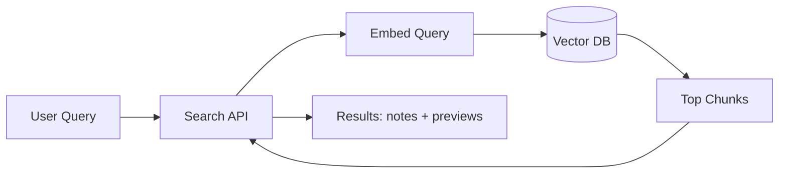

# Noteship — Embedding & Semantic Search Design

## Purpose

Define chunking, embedding lifecycle, and query flow for semantic-first search.

## MVP choice

- Semantic-only retrieval (return relevant notes and previews)
- No block-level highlight/jump in MVP

## Chunking

- Target: 300–800 tokens per chunk
- 10–15% overlap
- Chunk after markdown parsing / normalization
- Ignore non-text artifacts for embeddings

## Embedding lifecycle

- Generate `contentHash` when saving note.md
- If hash changed:
  - enqueue `EMBED_NOTE` job with `embeddingVersion`
- Worker:
  - reads note.md from S3
  - chunks
  - embeds
  - upserts into vector DB
  - updates DynamoDB embedding status/version

## Vector metadata (payload)

- userId (tenant)
- noteId
- chunkIndex
- embeddingVersion
- optional blockId (future)

## Query flow

1. User query → API
2. API creates query embedding
3. Vector DB similarity search filtered by `userId`
4. Return top chunks
5. API maps chunks → noteIds and returns results

## Mermaid: search flow

## Cost controls

- Cache embeddings per note version
- Limit chunk count per note if needed (hard caps)
- Consider cheaper embedding model once quality acceptable
