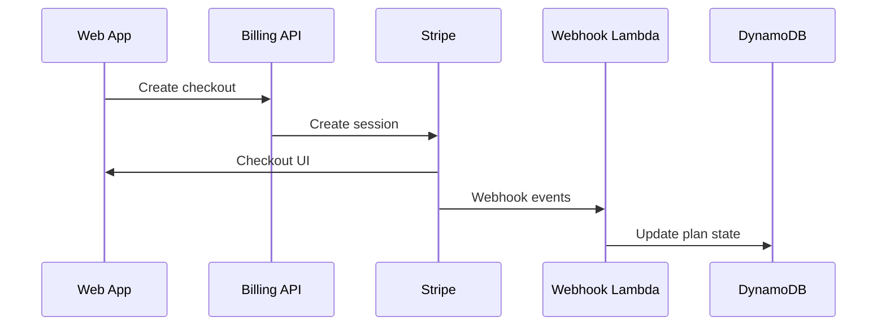

# Noteship — Billing & Stripe Integration

## Purpose
Define billing flows and how they map to entitlements.

## Flow: Upgrade
1) User clicks upgrade
2) Backend creates Stripe checkout session
3) User pays in Stripe
4) Stripe webhook updates subscription state in DynamoDB
5) Entitlements derived from `planId`

## Stripe objects
- Product: Noteship
- Prices: monthly/yearly per plan
- Subscription: active plan status

## Webhooks to handle
- `checkout.session.completed`
- `customer.subscription.updated`
- `customer.subscription.deleted`

## Stored billing state
- stripeCustomerId
- subscriptionId
- priceId
- planId (internal)
- status (active/past_due/canceled)
- currentPeriodEnd

## Security
- Verify webhook signature
- Idempotent processing (eventId)

## Mermaid: billing

## Upgrade/downgrade behavior
- Downgrade blocks gated actions but preserves data
- Quotas reset per billing period (monthly)
