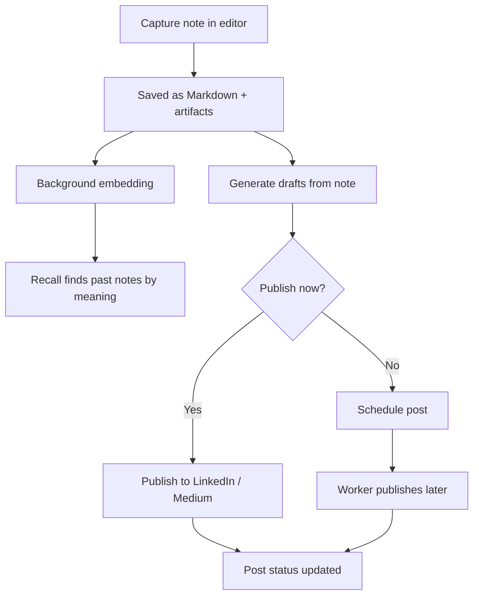

# Noteship — Product & Business Definition

**Document purpose:** Define the business intent, target user, MVP scope, pricing/entitlements, and product boundaries for Noteship so development can start with clear constraints.

_Last updated: 2026-01-28_

---

## 1) One-line definition

**Noteship helps solo consultants and coaches recall their thinking, repurpose notes into publish-ready drafts (LinkedIn + Medium), and publish consistently — powered by meaning-based recall when they don’t remember the exact wording.**

---

## 2) Target customer and positioning

### Primary ICP (MVP)

**Solo consultants / coaches** who:

- Produce knowledge work (frameworks, lessons, client patterns, insights)
- Want to publish consistently but struggle with time, reuse, and recall
- Need a “second brain” that can reliably resurface ideas and turn them into output

### Secondary ICP (later, not MVP)

- Educators, creators, writers, small agencies
- Teams / organizations (explicitly deferred)

### Positioning

- **AI-first notes → output workflow:** Recall → Repurpose → Publish.
- **Recall is semantic-powered** (meaning-based retrieval + resurfacing), but it’s not “just search.”
- Not a “general note app clone.” Not trying to beat Notion on broad workspace features.
- Not a generic “AI writer.” Output must be grounded in the user’s notes.

---

## 3) The core user problem (in business terms)

### Pain points (what they feel)

- “I wrote something great months ago but can’t find it.”
- “Publishing regularly is hard; I waste time rewriting from scratch.”
- “I want my voice/tone to stay consistent across posts.”
- “Tools either store notes or schedule posts — rarely both — and almost never grounded in my own notes.”

### Outcomes they pay for

- Recall insights quickly (meaning-based recall)
- Turn notes into drafts in minutes (repurpose)
- Publish consistently with less effort (workflow + scheduling)
- Keep content portable (easy export/import)

---

## 4) Jobs-to-be-done (JTBD)

### JTBD #1 — Recall (semantic-powered)

**When** I remember the idea but not the exact words,  
**I want** to recall by meaning and quickly resurface the relevant notes/snippets,  
**so I** can reuse prior thinking without redoing work.

### JTBD #2 — Repurpose to drafts

**When** I have a note that contains a useful insight,  
**I want** to convert it into a LinkedIn/Medium-ready draft in my voice,  
**so I** can publish consistently without spending hours writing.

### JTBD #3 — Publish and schedule

**When** I have a draft,  
**I want** to publish now or schedule for later,  
**so I** can maintain cadence even when busy.

---

## 5) MVP scope and user flows

### MVP feature set (no analytics)

1. **Auth + Account**
   - Sign up / sign in
   - Profile basics
   - Plan status awareness (free/paid)

2. **Notes**
   - Create/edit/delete notes
   - TipTap editor
   - Autosave
   - Attach files (stored in S3)
   - Export note as Markdown

3. **Recall (semantic-powered)**
   - Meaning-based recall across notes (vector-based)
   - Returns relevant notes/snippets
   - Optional “Related ideas” resurfacing (nice-to-have; can be minimal in MVP)
   - No in-note jump/highlighting requirement in MVP

4. **AI content generation (repurpose)**
   - Generate post drafts from a note
   - Tone/persona selection
   - Regenerate/refine drafts

5. **Publishing integrations**
   - Connect LinkedIn (OAuth)
   - Connect Medium (OAuth)
   - Publish immediately to LinkedIn
   - Publish immediately to Medium

6. **Scheduling**
   - Schedule posts
   - Edit/cancel scheduled posts
   - Status: draft / scheduled / published / failed
   - Retries on failure (basic reliability)

7. **Plans & entitlements**
   - Free vs paid gating
   - AI generation quotas
   - Scheduling restricted to paid (initially)

### MVP user journey (Mermaid)

---

## 6) Explicit non-goals (MVP boundaries)

These are intentionally out of scope to keep the build lean and cost-efficient:

- Teams, organizations, roles/permissions beyond single-user
- Advanced collaboration: comments, real-time multi-user editing
- Full “Notion replacement” features: databases, kanban, wikis, deep templates ecosystem
- Complex analytics dashboards (explicitly deferred)
- In-note semantic highlighting/jump-to-paragraph (nice-to-have later)
- Dozens of integrations at launch (architecture supports growth, but ship 2 first)

## 6.1 Languages (MVP requirement)

- Product must support **Arabic and English** with a user toggle.
- Arabic is first-class (native RTL, mirrored layouts); English remains LTR.
- Voice/tone follows brand guidelines (`docs/brand/noteship-language-guidelines.md`).

---

## 7) Differentiators (what makes it worth switching)

- **Recall by meaning** tailored to personal knowledge work (semantic-powered resurfacing)
- **Note → draft pipeline** with tone/persona control, grounded in your notes
- **Direct publishing + scheduling** to LinkedIn and Medium
- **Portability-first storage:** Markdown export/import mindset (avoid lock-in)

---

## 8) Pricing, plans, and entitlements (MVP approach)

### Principle

- Stripe handles **billing state**
- Noteship handles **entitlements** (what’s allowed)
- Frontend reflects entitlements (hide/disable/upsell)
- Backend enforces entitlements (never trust UI)

### Suggested plans (initial)

> Names can change; the structure matters.

**Free**

- Notes: limited count (or soft limit)
- Recall: enabled
- AI generations: low monthly quota
- Publishing: allowed (manual publish only)
- Scheduling: **disabled**
- Storage: limited

**Pro**

- Notes: higher or unlimited
- Recall: enabled
- AI generations: higher monthly quota
- Publishing: enabled
- Scheduling: **enabled**
- Storage: higher

### Entitlement types to support

- **Boolean** (on/off): `scheduled_publish`
- **Quota** (per month): `ai_generations_per_month`
- **Capacity**: `max_notes`, `max_storage_mb`

### Gating rules

- If user exceeds a limit: **do not delete data**.
  - Example: user downgrades → keep notes, block creating new ones.

---

## 9) Go-to-market (practical, MVP-aligned)

### Initial acquisition channels (pragmatic)

- LinkedIn content + DMs (dogfooding: Noteship helps you publish there)
- Communities where consultants/coaches hang out (niche groups)
- Partnerships with coaches/consultant creators (small affiliate/referrals)

### Early messaging angle

- “Recall your ideas — then turn them into drafts and ship consistently.”
- “From notes to posts, grounded in your own thinking.”

---

## 10) Risks and mitigation

### Risk: “Recall feels weak”

- Mitigation: prioritize recall quality early (chunking, embeddings, relevance tuning)

### Risk: Drafts feel generic / ungrounded

- Mitigation: enforce grounding rules; keep drafts tied to note content; clear “assumptions” handling

### Risk: Publishing integrations are brittle

- Mitigation: async job pipeline + retries + clear status and failure messages

### Risk: Cost creep from AI usage

- Mitigation: quotas + caching + chunk size discipline

### Risk: User trust (privacy)

- Mitigation: strong data isolation, encrypted tokens, transparent handling of AI data

---

## 11) Success criteria (MVP)

- **Activation:** user creates ≥ 3 notes in first week
- **Value moment:** user recalls an old idea and generates a draft from it
- **Workflow adoption:** user publishes ≥ 1 post/week (manual or scheduled)
- **Conversion:** meaningful upgrade rate from Free → Pro (driven by scheduling + higher AI quota)
- **Retention:** returning weekly to recall/repurpose notes

---

## 12) Open questions (parked but tracked)

- Exact plan names and pricing points
- Best default quotas (AI and storage)
- Whether recall includes in-note highlighting at v1.1
- Medium integration approach depending on API constraints
