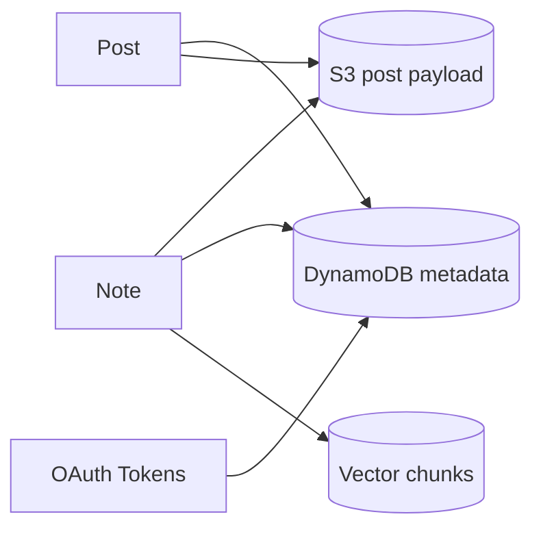

# Noteship — Data Architecture

## Purpose

Define how data is stored and referenced.

## Canonical content: S3

Paths (example):

- `users/{userId}/notes/{noteId}/note.md`
- `users/{userId}/notes/{noteId}/artifacts/{artifactId}`

Bucket settings:

- Private access
- Versioning ON
- Optional lifecycle rules for old versions

## Metadata: DynamoDB (suggested tables)

### Table: Users

- PK: `userId`
- Attributes:
  - `email`, `name`, `createdAt`
  - `planId`, `subscriptionStatus`, `currentPeriodStart`, `currentPeriodEnd`
  - `stripeCustomerId` (optional)

### Table: Notes

- PK: `userId`
- SK: `noteId`
- Attributes:
  - `noteId`, `title`, `tags[]`, `createdAt`, `updatedAt`
  - `s3Key`, `contentHash`, `embeddingStatus`, `embeddingVersion`
  - `editorFormat` (tiptap/markdown) (optional)
- Indexes:
  - GSI1 (ByUpdatedAt): `userId` (PK), `updatedAt` (SK, ISO string)
  - Optional tag index later (avoid premature complexity)

### Table: Posts

- PK: `userId`
- SK: `postId`
- Attributes:
  - `postId`, `noteId` (source)
  - `provider` (linkedin/medium)
  - `status` (draft|queued|scheduled|publishing|published|failed)
  - `scheduledAt`, `publishedAt`
  - `contentS3Key` (draft.md)
  - `error` (lastErrorCode/message) nullable
  - `createdAt`, `updatedAt`
- Indexes:
  - GSI1 (ByStatusUpdatedAt): `userId` (PK), `statusUpdatedAt` (SK, `${status}#${updatedAt}`)
  - GSI2 (BySchedule): `scheduleStatus` (PK, value `scheduled`), `scheduledAt` (SK, ISO string)

### Table: IntegrationAccounts

- PK: `userId`
- SK: `providerAccountId` (e.g., `${provider}#${accountId}`)
- Attributes:
  - `provider`, `accountId`, `status`
  - `scopes[]`, `connectedAt`, `updatedAt`
  - `tokenRef` (future Secrets Manager pointer) or encrypted token blob
  - provider identifiers (URNs, usernames)

### Table: Usage

- PK: `userId`
- SK: `periodStart` (ISO date; use Stripe `current_period_start`)
- Attributes:
  - `aiGenerationsUsed`, `scheduledPostsUsed`
  - `postsPublished` (optional; analytics)
  - `storageUsedMb` (optional)

Notes:

- `storageUsedMb` is reserved on upload init to enforce `max_storage_mb` entitlements.
- Consider a later reconcile step on upload completion to adjust for failed uploads.

### Table: Jobs (optional)

- PK: `userId`
- SK: `jobId`
- Attributes:
  - `type` (EMBED_NOTE|PUBLISH_POST|IMPORT_NOTE)
  - `status` (queued|running|succeeded|failed)
  - `payload` (small), `createdAt`, `updatedAt`

## DynamoDB capacity + recovery (MVP defaults)

- **Capacity mode:** Provisioned with auto scaling caps to keep total max RCUs/WCUs within the Always Free tier (25/25). Caps are defined in infra and should be raised for production traffic.
- **PITR:** Disabled in MVP for cost control; enable for production per the production checklist.

## Vector DB (Qdrant) schema (conceptual)

Collection: `noteship_notes_{env}`
Payload per vector:

- `userId`
- `noteId`
- `chunkIndex`
- `embeddingVersion`
- optional `blockId` (future highlighting)

## Mermaid: storage mapping

## Re-embedding rule

- Compute `contentHash` on save; set `embeddingVersion` to that hash (or S3 versionId).
- If `contentHash` changes → regenerate vectors for new `embeddingVersion`
- Old vectors deleted or left until cleanup
