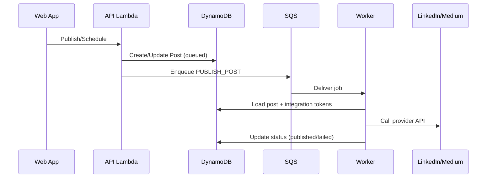

# Noteship — Connector & Integration Architecture

## Purpose

Enable increasing number of export/import vendors over time without spaghetti.

## Core decision

Use a **connector interface** + **async job pipeline**.
Connectors are modules inside the monorepo initially; can become separate services later.

## Connector interface (conceptual)

Export (publish):

- `publishPost(input): output`
- `validateConnection()`
- `refreshTokenIfNeeded()`
  Import:
- `ingest(payload)` OR `poll()`
- `normalizeToInternal()`

## Job pipeline

- API enqueues commands to SQS:
  - `PUBLISH_POST`
  - `IMPORT_ITEM`
- Worker executes connector logic, retries, DLQ
- Provider rate limits handled centrally per connector
- Scheduled posts: store `scheduledAt` in DDB and a dispatcher Lambda (every minute) enqueues `PUBLISH_POST` for due items
- For LinkedIn media posts, worker performs synchronous media upload (image/PDF) and then creates the post in the same job execution (no media-status polling dependency).

## Integration accounts

Store per-user provider account state:

- provider
- token set (encrypted)
- scopes
- provider identifiers (URNs, usernames)
- status
- publish payload snapshot (`users/{userId}/posts/{provider}/{postId}/payload.json`) used by worker for deterministic publish/schedule behavior

## Mermaid: publish job flow

## Extension strategy

- Keep vendor-specific fields inside connector modules, not domain entities
- Use internal normalized models for notes/posts
