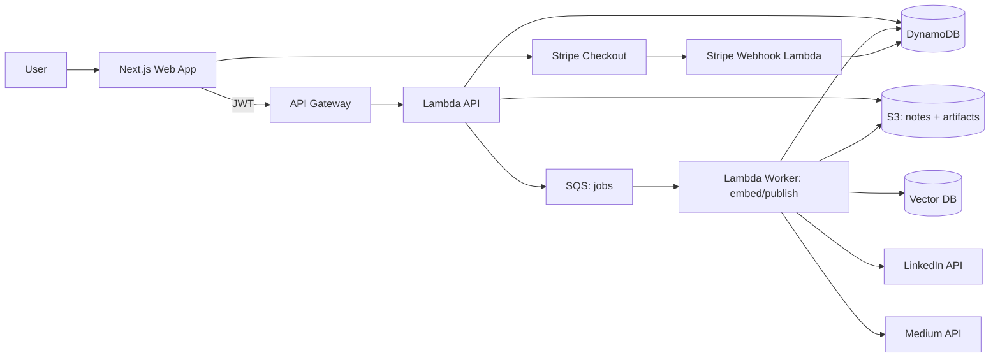

# Noteship — System High-Level Architecture (HLD)

## Purpose

Describe major components, boundaries, and data flows.

## Components

- Next.js web app (landing + dashboard)
- API Gateway (HTTP API) + Lambda
- Auth0 JWT authorizer (hosted login, Google SSO, passwordless email)
- DynamoDB (metadata, posts, integration accounts, usage)
- S3 (Markdown notes + artifacts)
- SQS + Lambda workers (publishing, embedding)
- Vector DB (Qdrant Cloud)
- Stripe (billing)
- OAuth providers (LinkedIn, Medium)

## High-level diagram

## Key flows

### Note save

1. Web app sends note content
2. API stores Markdown to S3 + metadata to DynamoDB
3. API emits embed job to SQS

### Search

1. Web app calls search endpoint with query
2. API queries vector DB
3. API returns ranked note references + previews

### Publish/schedule

1. User creates post from note
2. API enqueues publish job
3. Worker calls LinkedIn/Medium, updates status, retries failures
