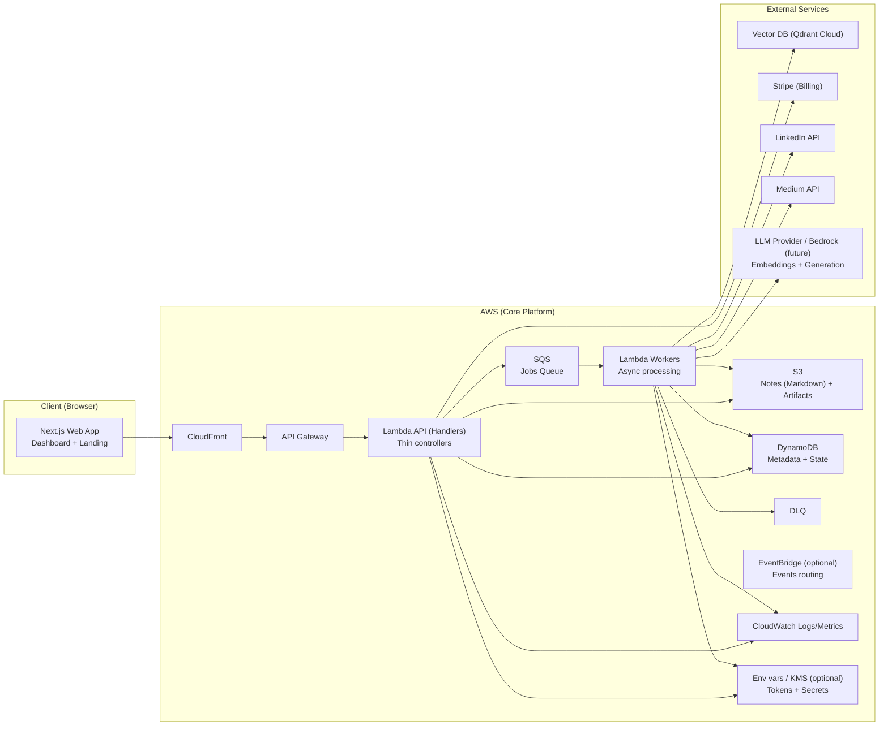
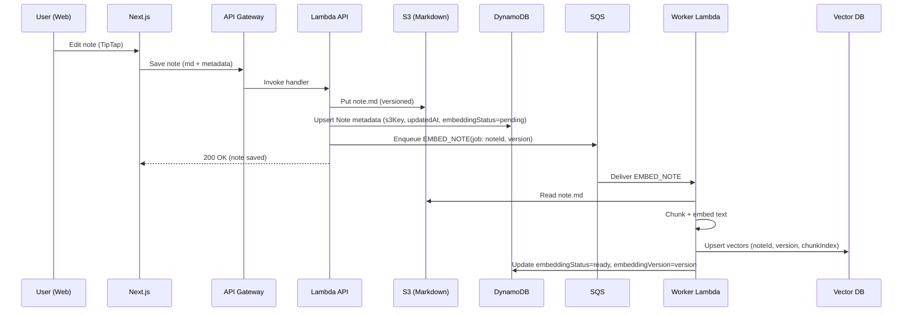
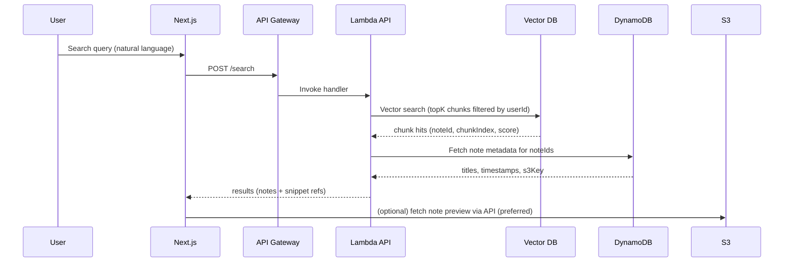
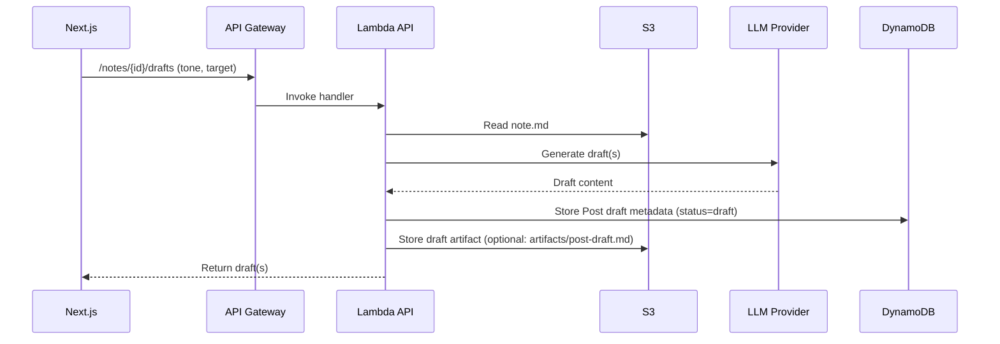
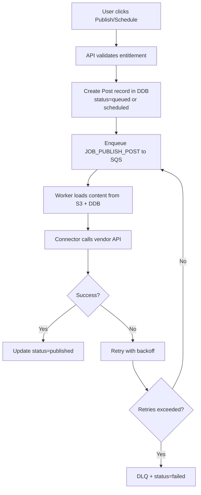
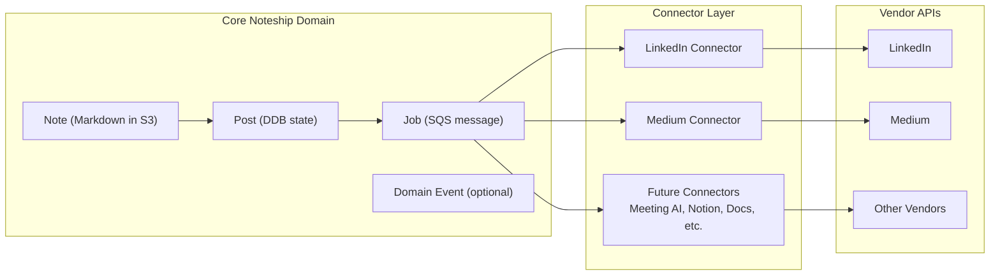
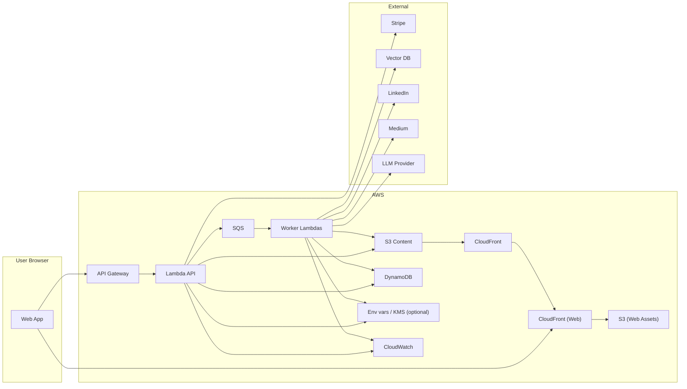

# Noteship — System Architecture (HLD)

**Document purpose:** Provide the end-to-end architectural “map” of Noteship at a high level (components, boundaries, major data flows, and deployment topology) without low-level implementation details.

**Architecture goals (MVP):**

- AWS-first, serverless where it makes sense
- Cost-efficient for low initial scale (solo users)
- Modular enough to add many integrations over time (imports/exports)
- Reliable async workflows (publishing, embedding)
- Clear separation: **content** vs **metadata** vs **indexes** vs **billing**

Details: `docs/technical/detailed/03-mvp-scope-and-feature-definition.md`, `docs/technical/detailed/05-functional-requirements.md`, `docs/technical/detailed/06-non-functional-requirements.md`.

---

## 1) System overview

### Core concepts

- **Canonical content**: Markdown notes + artifacts stored in S3
- **Metadata**: Note lists, statuses, user config, subscriptions in DynamoDB
- **Derived indexes**: Vector embeddings in a managed Vector DB (e.g., Qdrant)
- **Integrations**: Connector-based architecture (LinkedIn/Medium now; more later)
- **Async-first**: SQS jobs processed by worker Lambdas with retries + DLQ

### High-level component diagram

Details: `docs/technical/detailed/07-system-high-level-architecture.md`.

---

## 2) Frontend architecture (high level)

### Choice

- **Single Next.js app** (Landing + Dashboard) for simplicity:
  - One auth integration
  - One deployment pipeline
  - Shared UI/components without duplication

### Frontend responsibilities

- Auth UI and session handling
- Rich text editing (TipTap)
- Calling API endpoints for notes, search, posts, scheduling
- Client-side feature gating (hide/disable) based on entitlements snapshot
- Showing async job statuses (scheduled/published/failed)
- Bilingual UX (EN/AR) with RTL/LTR layout mirroring per brand docs (`docs/brand/noteship-language-guidelines.md`, `docs/brand/noteship-layout-rtl-ltr.md`, `docs/brand/noteship-typography.md`)

### Frontend non-responsibilities

- Never enforce security/plan gates solely in UI
- Never call vendor APIs directly (LinkedIn/Medium)
- Never store secrets/tokens in the browser

Details: `docs/technical/detailed/08-frontend-architecture.md`.

---

## 3) Backend architecture (high level)

### Core backend building blocks

1. **API Layer (API Gateway + Lambda API)**
   - Stateless request handlers
   - Validates input, resolves user identity, calls use-cases
   - Auth0 JWT authorizer (Universal Login; Google SSO + passwordless email)
   - Writes canonical content to S3 and metadata to DynamoDB
   - Enqueues async jobs (embedding, publishing)

2. **Async Layer (SQS + Worker Lambdas + DLQ)**
   - Performs long-running or unreliable work:
     - embedding / vector upsert
     - publishing to vendors
     - scheduling execution
   - Retries with backoff
   - DLQ for visibility and manual replay later

3. **Integration Layer (Connectors)**
   - Each vendor is a connector module implementing a standard contract
   - Auth tokens stored server-side and used by workers
   - Connector logic is isolated from core domain logic

4. **Billing Layer (Stripe)**
   - Stripe is source-of-truth for billing events
   - Noteship persists subscription state and derives entitlements
   - Webhooks update plan status; app does not trust client claims

Details: `docs/technical/detailed/09-backend-architecture.md`, `docs/technical/detailed/11-api-design-and-contracts.md`, `docs/technical/detailed/14-billing-and-stripe-integration.md`.

---

## 4) Data & storage boundaries (what lives where)

### S3 (canonical content)

- `note.md` stored per note
- `artifacts/*` stored per note (images, exports, generated outputs)
- Versioning enabled (supports history + safe re-embedding)

### DynamoDB (system of record for state/metadata)

- Notes metadata: titles, tags, timestamps, s3Key, embedding status/version
- Posts metadata: draft/scheduled/published/failed, target vendor, schedule time
- Integration accounts: vendor connections, token references, status
- Subscription state: current plan, status, period end
- Usage counters: quotas per billing period (optional in MVP but recommended)

### Vector DB (derived index)

- Chunk embeddings with metadata `{userId, noteId, chunkIndex, version}`
- Rebuilt anytime; never treated as canonical

Details: `docs/technical/detailed/10-data-architecture.md`.

---

## 5) Key flows (request + async)

Details: `docs/technical/detailed/11-api-design-and-contracts.md`, `docs/technical/detailed/12-connector-and-integration-architecture.md`, `docs/technical/detailed/13-embedding-and-semantic-search-design.md`.

### 5.1 Create / update a note

**Intent:** Persist canonical content and keep semantic search index up to date.

### 5.2 Semantic search

**Intent:** User finds notes by meaning (not exact wording).

> MVP returns “relevant notes/snippets.” In-note jump/highlighting is deferred but the model is compatible with later block-level mapping.

### 5.3 Generate a post from a note

**Intent:** Convert a note into a LinkedIn/Medium-ready draft with tone/persona.

### 5.4 Publish now vs schedule

**Intent:** Use async pipeline for reliability and vendor rate limits.

---

## 6) Integration / connector model (scales with vendors)

### Why a connector model

Integrations will grow (export + import). Avoid hardcoding vendor logic into core features.

### Connector boundaries

- Core emits commands/events in **internal schema**
- Connectors map internal schema to vendor API calls and back
- Connectors run in worker context (server-side) and use stored tokens

### Connector contract (conceptual)

- `connect()` / `disconnect()` (OAuth lifecycle)
- `export()` / `publish()` for outbound
- `ingest()` for inbound (webhook or poll)
- `refreshToken()` for auth maintenance
- `validate()` for token/account health

### Integration pipeline (high level)

Details: `docs/technical/detailed/12-connector-and-integration-architecture.md`.

---

## 7) Deployment topology (MVP)

Details: `docs/technical/detailed/15-deployment-and-infrastructure.md`.

### Environments

- **dev**: fast iteration, lower limits, sandbox tokens
- **prod**: real billing, stricter permissions, observability

### Hosting choices (recommended for MVP)

- **AWS-only** hosting for the web app:
  - S3 + CloudFront for landing (SSG) and dashboard (SPA)
  - No SSR, no Next API routes
- AWS hosts:
  - API Gateway + Lambda
  - S3 + CloudFront for artifacts/content delivery
  - DynamoDB
  - SQS + workers
  - Env vars / KMS (optional)

### Deployment diagram (topology)

---

## 8) Operational principles (HLD-level)

Details: `docs/technical/detailed/06-non-functional-requirements.md`.

### Security

- Tokens for vendors stored server-side (encrypted)
- Backend enforces entitlements and authorization
- Per-user isolation in keys/partitions and access policies

### Reliability

- Async jobs for vendor calls and embeddings
- Retries + DLQ for failure visibility
- Idempotency keys for publish jobs (avoid duplicate posts)

### Cost efficiency

- Serverless compute
- S3 for large content
- Vector DB external to avoid OpenSearch cluster fixed costs (MVP)
- Quotas/limits for AI usage

---

## 9) Future evolution (without redesign)

This HLD supports adding:

- Many import/export connectors (meeting AI, Notion, Google Docs)
- In-note semantic highlighting (store block mapping in vector metadata)
- Teams/workspaces (extend DDB schema; add permissions model)
- Analytics module (later) fed by domain events/outbox pattern
